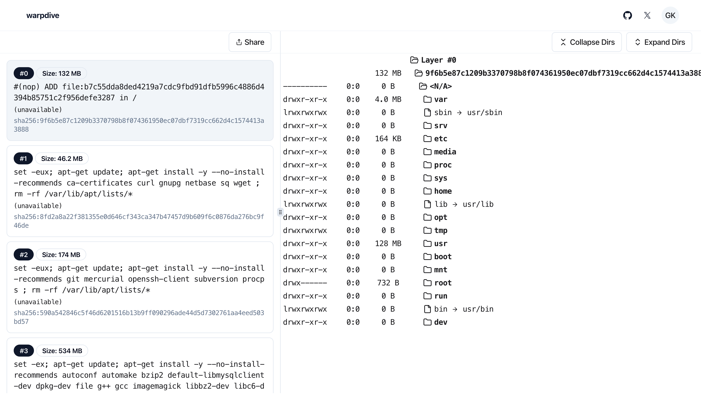

# warpdive

[](https://github.com/gvkhna/warpdive/actions/workflows/deploy.yml)


---

**Modern Docker/OCI Image Inspector**



Warpdive is a container inspector for docker/OCI container images. With warpdive you can easily see the changes being made inside your container for each layer. What each command is doing and how it's affecting your overall container image during build.

To get started, create an account at [warpdive.xyz](https://www.warpdive.xyz).

```sh
npx warpdive login
```

You can build your own image.

```sh
npx warpdive build .
```

Or inspect another image.

```sh
npx warpdive push ubuntu:latest
```

To learn more visit [warpdive.xyz](https://www.warpdive.xyz).
